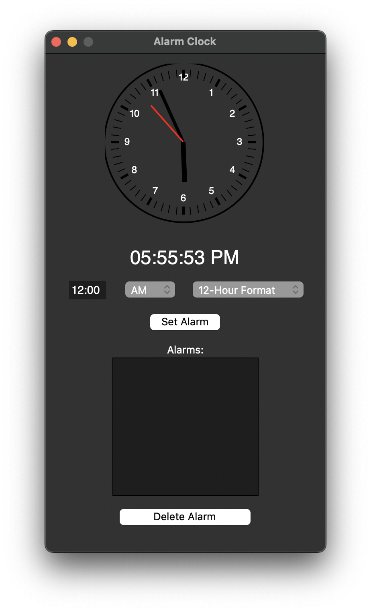

# Simple Python Alarm Clock

This is a simple alarm clock written in Python.

## Screenshots



## Usage

```bash
git clone https://github.com/is-shaun/python-alarm-clock.git
pip install virtualenv
python -m venv venv
source venv/bin/activate 
pip install -r requirements.txt
python app.py
```

or

```bash
git clone https://github.com/is-shaun/python-alarm-clock.git
pip3 install virtualenv
python3 -m venv venv
source venv/bin/activate
pip3 install -r requirements.txt
python3 app.py
```

## Credits

- [Analog Clock](https://thinkinfi.com/build-digital-analog-clock-gui-with-python-tkinter/)

## Authors

- [Ishan](https://github.com/is-shaun)
